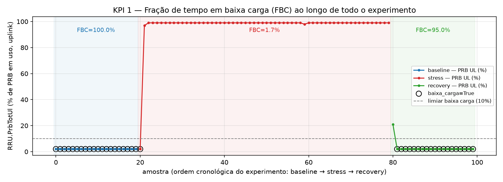
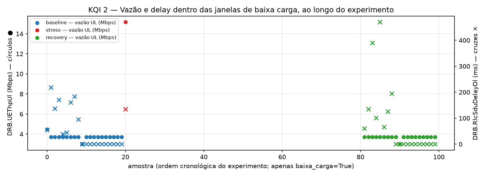

# G6 — Economia de energia (intenção simulada)

Projeto integrador — Análise de Dados aplicada a Redes de Telecomunicações
Prof. Jonas Augusto Kunzler

Alessandro Rocha · Erik Ferreira · Alexandre Barbosa

---

## Pergunta do grupo

Em que trechos do experimento a carga da célula está baixa o suficiente para, em tese,
justificar uma política de economia de energia — **sem desligar nada de verdade**?

---

## Fonte de dados e pipeline

- `repo/data/code/datasets/kpm-ue-tp-sample/` (trilha offline oficial)
- Lab `oai-cn-gnb-nonrt-nearrt`, caso UE-TP / load-anomaly
- `run_id = ue-tp-20260804-174422`, 100 amostras
- Fases: `baseline` (20) → `stress` (60) → `recovery` (20)
- Pipeline: `01_etl_kpm.ipynb` → `02_eda_kpm.ipynb` → `03_recomendacao_a1.ipynb`

---

## Qualidade dos dados (QC)

- Sem payload vazio, sem duplicatas por `(run_id, phase, sample_index)`
- `ingested_at` em UTC
- `DRB.UEThpDl` 100% nulo nesta amostra — gap de coleta, não usado nos indicadores
- Apenas 1 `run_id` disponível — resultados descrevem este experimento específico

---

## KPI 1 — Fração de tempo em baixa carga (FBC)

```
FBC(fase) = (nº amostras com RRU.PrbTotUl <= 10%) / (nº total de amostras na fase)
```

| Fase | FBC |
|---|---|
| baseline | 100,0% |
| stress | 1,7% (outlier pontual) |
| recovery | 95,0% |



---

## KQI 2 — Vazão/delay médios nas janelas de baixa carga

```
ThpUL_bc = média(DRB.UEThpUl | baixa_carga = True)
Delay_bc = média(DRB.RlcSduDelayDl | baixa_carga = True)
```

| Fase | Vazão UL média | Delay médio |
|---|---|---|
| baseline | 3,72 Mbps | 55,25 ms |
| recovery | 3,68 Mbps | 81,21 ms |



---

## O que os indicadores não provam

- FBC é um **proxy de oportunidade**, não uma medição de consumo de energia real
- Amostra pequena (100 pontos, 1 `run_id`) — sem poder estatístico para generalizar
- `stress | baixa_carga=True` tem só 1 ponto — outlier, não tendência
- Sem atuação física na RAN — qualquer política é uma intenção simulada (dry-run)

---

## Recomendação / Política A1 (dry-run)

```
candidatar_economia(fase) = FBC(fase) >= 90%  AND  Delay_bc(fase) <= 161,98 ms (delay do stress)
```

| Fase | Decisão |
|---|---|
| baseline | `apply` |
| stress | `do_not_apply` |
| recovery | `apply` |

Artefato: `derived/decision_g6.json` — sempre `actuation.mode = "emulate"`.

---

## Limitações

- RFSIM ≠ rede real (telemetria sintética)
- Amostra curta, único `run_id`, poucos UEs
- Sem atuação física na RAN (dry-run apenas)
- Dados sintéticos, sem informação pessoal — uso acadêmico
- Não mede consumo de energia real (proxy de oportunidade)

---

## Conclusão

- Baseline e recovery concentram as janelas de baixa carga, com qualidade estável
- Stress elimina qualquer oportunidade de economia de energia
- Próximo passo (fora de escopo): repetir o experimento com mais `run_id`s e mais UEs
  para validar se o padrão se generaliza

---

# Obrigado — perguntas?

Defesa individual: cada integrante responde pela parte que liderou
(dados/QC · indicadores/análise · decisão/limitações)
